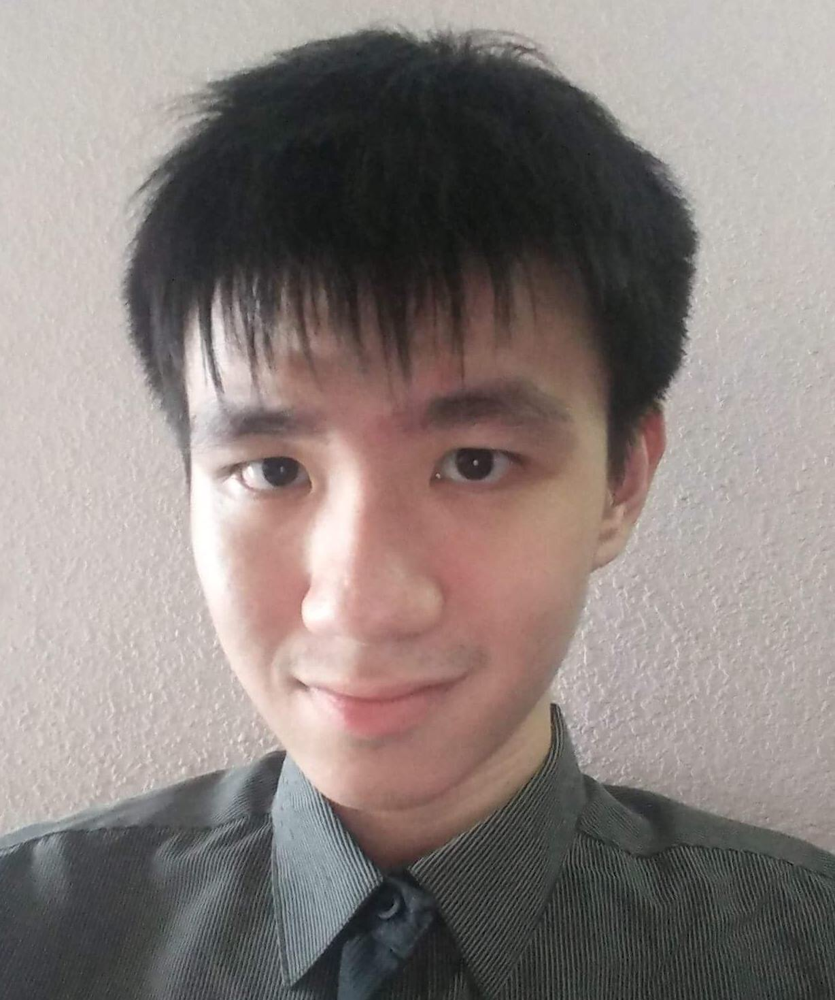
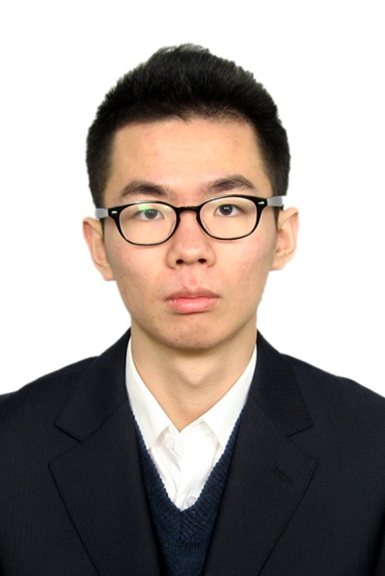
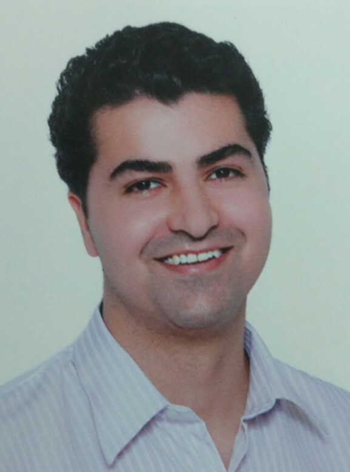

# About Us

We are a team based in the [School of Computing, National University of Singapore](http://www.comp.nus.edu.sg).

## Project Team

#### [NEO WEI JIE ESMOND](http://github.com/zeticious)  
 
Role: Project Leader  
Responsibilities: In charge of UI 

-----

#### [LIU PENG](http://github.com/lproperty)
 
Role: Developer  
Responsibilities: In charge of Testing

-----

#### [KENNY NG JIAN LIANG](http://github.com/kennyngdsc)
 
Role: Developer  
Responsibilities: In charge of Code Quality

-----

#### [MANISH DAHIYA](http://github.com/Manish1Dahiya)
 
Role: Developer  
Responsibilities: In charge of Documentation

-----

# Contribution

We welcome contributions. See [Contact Us](ContactUs.md) page for more info.
