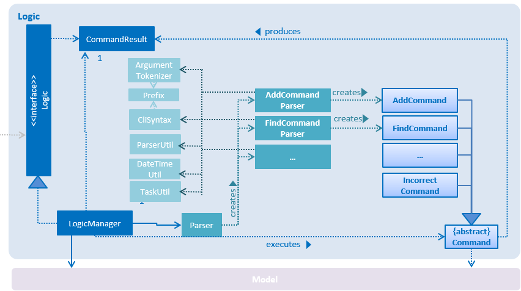
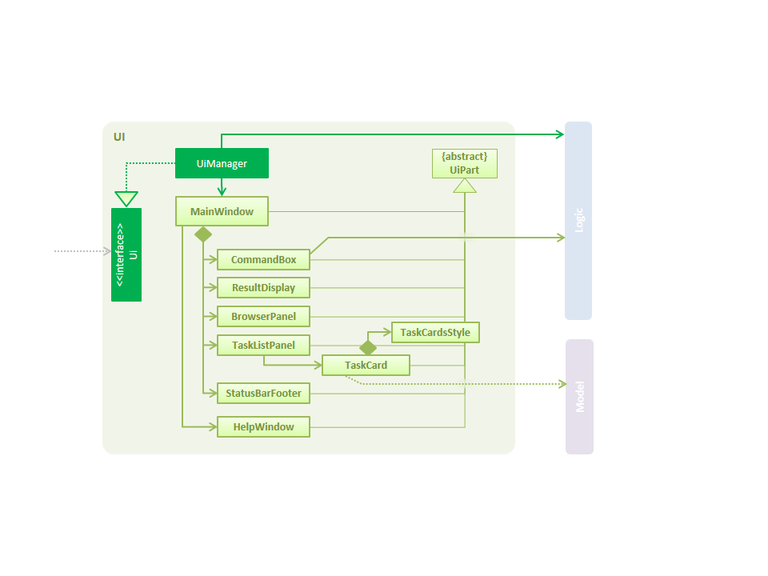
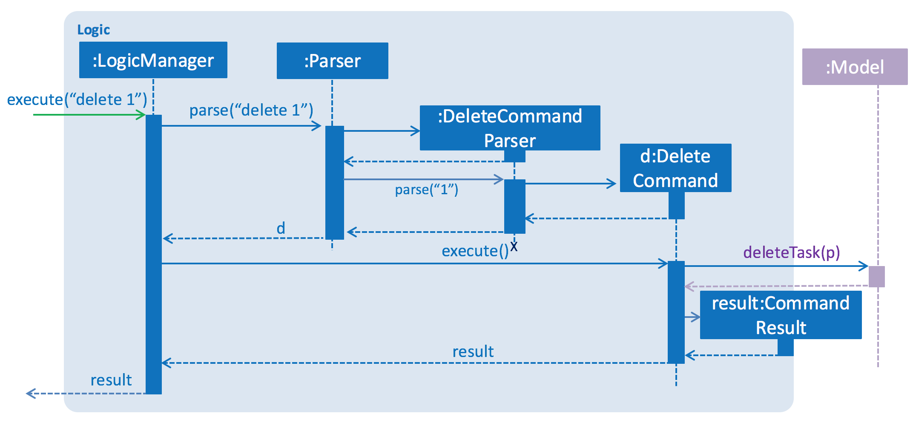
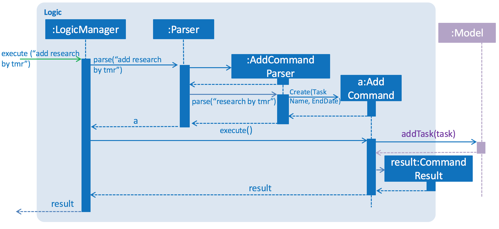
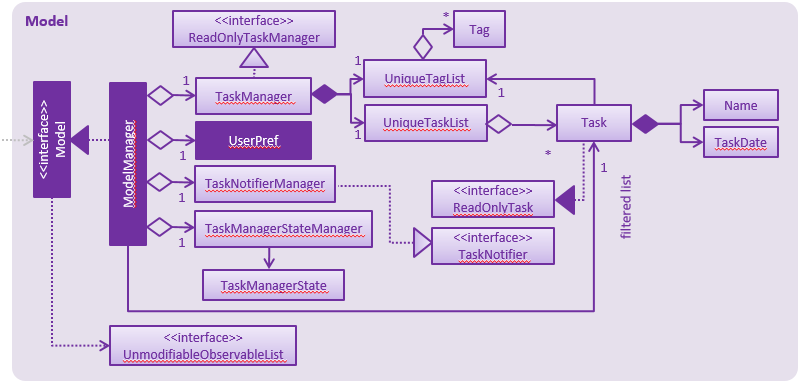
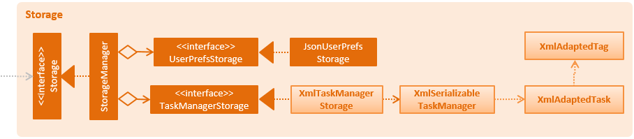

# Pota-Todo (Task Manager) - Developer Guide

By : `CS2103JAN2017-T15-B3`  &nbsp;&nbsp;&nbsp;&nbsp; Since: `Feb 2017`  &nbsp;&nbsp;&nbsp;&nbsp; Licence: `MIT`

---

1. [Setting Up](#setting-up)
2. [Design](#design)
3. [Implementation](#implementation)
4. [Testing](#testing)
5. [Dev Ops](#dev-ops)

* [Appendix A: User Stories](#appendix-a--user-stories)
* [Appendix B: Use Cases](#appendix-b--use-cases)
* [Appendix C: Non Functional Requirements](#appendix-c--non-functional-requirements)
* [Appendix D: Glossary](#appendix-d--glossary)
* [Appendix E : Product Survey](#appendix-e--product-survey)

## 1. Setting up

### 1.1. Prerequisites

1. **JDK `1.8.0_60`**  or later 

    > Having any Java 8 version is not enough.  
    This app will not work with earlier versions of Java 8.

2. **Eclipse** IDE
3. **e(fx)clipse** plugin for Eclipse (Do the steps 2 onwards given in
   [this page](http://www.eclipse.org/efxclipse/install.html#for-the-ambitious))
4. **Buildship Gradle Integration** plugin from the Eclipse Marketplace
5. **Checkstyle Plug-in** plugin from the Eclipse Marketplace

### 1.2. Importing the project into Eclipse

0. Fork this repo, and clone the fork to your computer
1. Open Eclipse (Note: Ensure you have installed the **e(fx)clipse** and **buildship** plugins as given
   in the prerequisites above)
2. Click `File` > `Import`
3. Click `Gradle` > `Gradle Project` > `Next` > `Next`
4. Click `Browse`, then locate the project's directory
5. Click `Finish`

  > * If you are asked whether to 'keep' or 'overwrite' config files, choose to 'keep'.
  > * Depending on your connection speed and server load, it can even take up to 30 minutes for the set up to finish
      (This is because Gradle downloads library files from servers during the project set up process)
  > * If Eclipse auto-changed any settings files during the import process, you can discard those changes.

### 1.3. Configuring Checkstyle
1. Click `Project` -> `Properties` -> `Checkstyle` -> `Local Check Configurations` -> `New...`
2. Choose `External Configuration File` under `Type`
3. Enter an arbitrary configuration name e.g. taskmanager
4. Import checkstyle configuration file found at `config/checkstyle/checkstyle.xml`
5. Click OK once, go to the `Main` tab, use the newly imported check configuration.
6. Tick and select `files from packages`, click `Change...`, and select the `resources` package
7. Click OK twice. Rebuild project if prompted

> Note to click on the `files from packages` text after ticking in order to enable the `Change...` button

### 1.4. Troubleshooting project setup

**Problem: Eclipse reports compile errors after new commits are pulled from Git**

* Reason: Eclipse fails to recognize new files that appeared due to the Git pull.
* Solution: Refresh the project in Eclipse: 
  Right click on the project (in Eclipse package explorer), choose `Gradle` -> `Refresh Gradle Project`.

**Problem: Eclipse reports some required libraries missing**

* Reason: Required libraries may not have been downloaded during the project import.
* Solution: [Run tests using Gradle](UsingGradle.md) once (to refresh the libraries).

## 2. Design

### 2.1. Architecture

 
_Figure 2.1.1 : Architecture Diagram_

The **_Architecture Diagram_** given above explains the high-level design of the App.
Given below is a quick overview of each component.

> Tip: The `.pptx` files used to create diagrams in this document can be found in the [diagrams](diagrams/) folder.
> To update a diagram, modify the diagram in the pptx file, select the objects of the diagram, and choose `Save as picture`.

`Main` has only one class called [`MainApp`](../src/main/java/seedu/address/MainApp.java). It is responsible for,

* At app launch: Initializes the components in the correct sequence, and connects them up with each other.
* At shut down: Shuts down the components and invokes cleanup method where necessary.

[**`Commons`**](#common-classes) represents a collection of classes used by multiple other components.
Two of those classes play important roles at the architecture level.

* `EventsCenter` : This class (written using [Google's Event Bus library](https://github.com/google/guava/wiki/EventBusExplained))
  is used by components to communicate with other components using events (i.e. a form of _Event Driven_ design)
* `LogsCenter` : Used by many classes to write log messages to the App's log file.

The rest of the App consists of four components.

* [**`UI`**](#ui-component) : The UI of the App.
* [**`Logic`**](#logic-component) : The command executor.
* [**`Model`**](#model-component) : Holds the data of the App in-memory.
* [**`Storage`**](#storage-component) : Reads data from, and writes data to, the hard disk.

Each of the four components

* Defines its _API_ in an `interface` with the same name as the Component.
* Exposes its functionality using a `{Component Name}Manager` class.

For example, the `Logic` component (see the class diagram given below) defines it's API in the `Logic.java`
interface and exposes its functionality using the `LogicManager.java` class. 
 
_Figure 2.1.2 : Class Diagram of the Logic Component_

#### Events-Driven nature of the design

The _Sequence Diagram_ below shows how the components interact for the scenario where the user issues the
command `delete 1`.

 
_Figure 2.1.3a : Component interactions for `delete 1` command (part 1)_

>Note how the `Model` simply raises a `TaskManagerChangedEvent` when the Task Manager data are changed,
 instead of asking the `Storage` to save the updates to the hard disk.

The diagram below shows how the `EventsCenter` reacts to that event, which eventually results in the updates
being saved to the hard disk and the status bar of the UI being updated to reflect the 'Last Updated' time.  
 
_Figure 2.1.3b : Component interactions for `delete 1` command (part 2)_

> Note how the event is propagated through the `EventsCenter` to the `Storage` and `UI` without `Model` having
  to be coupled to either of them. This is an example of how this Event Driven approach helps us reduce direct
  coupling between components.

The sections below give more details of each component.

### 2.2. UI component

 
_Figure 2.2.1 : Structure of the UI Component_

**API** : [`Ui.java`](../src/main/java/seedu/address/ui/Ui.java)

The UI consists of a `MainWindow` that is made up of parts e.g.`CommandBox`, `ResultDisplay`, `TaskListPanel`,
`StatusBarFooter`, `BrowserPanel` etc. All these, including the `MainWindow`, inherit from the abstract `UiPart` class.

The `UI` component uses JavaFx UI framework. The layout of these UI parts are defined in matching `.fxml` files
 that are in the `src/main/resources/view` folder. 
 For example, the layout of the [`MainWindow`](../src/main/java/seedu/address/ui/MainWindow.java) is specified in
 [`MainWindow.fxml`](../src/main/resources/view/MainWindow.fxml)

The `UI` component,

* Executes user commands using the `Logic` component.
* Binds itself to some data in the `Model` so that the UI can auto-update when data in the `Model` change.
* Responds to events raised from various parts of the App and updates the UI accordingly.

For the TaskCard, an additional `TaskCardStyle` class is used to colour code the card. It will be red if the task is undone, and green if the task is completed.

### 2.3. Logic component

 
_Figure 2.3.1 : Structure of the Logic Component_

**API** : [`Logic.java`](../src/main/java/seedu/address/logic/Logic.java)

`Logic` uses the `Parser` class to parse the user command. This results in a `Command` object which is executed by the `LogicManager`. The command execution can affect the `Model` (e.g. adding a task) and/or raise events. The result of the command execution is encapsulated as a `CommandResult` object which is passed back to the `Ui`.

**`Logic` Interface**

The `Logic` interface provides logic operations without exposing any implementation information of the `LogicManager` class.
The method `execute(String commandText)` identifies the command input in the `commandText` string and execute the command accordingly. Additionally, the method `getFilteredTaskList()` retrieves and returns the filtered task list from `model` component. 

**LogicManager` Class**
The `LogicManager` class implements the `Logic` interface, providing implementations to all the functionalities required in the interface. It executes commands passed in from the `UI` component by first parsing the command string with `Parser` class and then executing the returned `Command` object to generate `CommandResult` which will be returned back to `UI` component to be displayed.

**`Parser` Class**
The `Parser` class parses given command string into its respective `Command` object. Simple Natural Language Processing(NLP) is used as parsing mechanism so that simple markers (e.g. from, to, by etc)stored in `CliSnytax` class will be identified and relevant arguments after such markers will be extracted. `Parser` will then call corresponding `Command` class constructor to construct the identified type of command.

**`Command` Class**
The `Command` class receives parsed argument from `Parser` class. Afterwards, it generates `CommandResult`  based on the input after execution by `Logic` class. The abstract `Command` class is inherited by multiple sub-classes which are specific `Command` types, each able to generate a corresponding `CommandResult`. The `Logic` class will execute the specific `Command` and modify the data in `Model` component.

Given below is the Sequence Diagram for interactions within the `Logic` component for the `execute("delete 1")`
 API call. 
 
_Figure 2.3.1 : Interactions Inside the Logic Component for the `delete 1` Command_

 
_Figure 2.3.2 : Interactions Inside the Logic Component for the `add research by tmr` Command_

### 2.4. Model component

 
_Figure 2.4.1 : Structure of the Model Component_

**API** : [`Model.java`](../src/main/java/seedu/address/model/Model.java)

The `Model`,

* stores a `UserPref` object that represents the user's preferences.
* stores the Task Manager data.
* exposes a `UnmodifiableObservableList<ReadOnlyTask>` that can be 'observed' e.g. the UI can be bound to this list
  so that the UI automatically updates when the data in the list change.
* does not depend on any of the other three components.

### 2.5. Storage component

 
_Figure 2.5.1 : Structure of the Storage Component_

**API** : [`Storage.java`](../src/main/java/seedu/address/storage/Storage.java)

The `Storage` component,

* can save `UserPref` objects in json format and read it back.
* can save the Task Manager data in xml format and read it back.
* It stores relevant date object as a string which will be parsed by `DateTimeUtil.dateTimeParse`.

### 2.6. Common classes

Classes used by multiple components are in the `seedu.taskmanager.commons` package.

## 3. Implementation

### 3.1. Logging

We are using `java.util.logging` package for logging. The `LogsCenter` class is used to manage the logging levels
and logging destinations.

* The logging level can be controlled using the `logLevel` setting in the configuration file
  (See [Configuration](#configuration))
* The `Logger` for a class can be obtained using `LogsCenter.getLogger(Class)` which will log messages according to
  the specified logging level
* Currently log messages are output through: `Console` and to a `.log` file.

**Logging Levels**

* `SEVERE` : Critical problem detected which may possibly cause the termination of the application
* `WARNING` : Can continue, but with caution
* `INFO` : Information showing the noteworthy actions by the App
* `FINE` : Details that is not usually noteworthy but may be useful in debugging
  e.g. print the actual list instead of just its size

### 3.2. Configuration

Certain properties of the application can be controlled (e.g App name, logging level) through the configuration file
(default: `config.json`):

### 3.3. Handling different types of tasks

We used `Optional` attributes in our implementation of different type of tasks.
* If a task is a floating task (no dates specified), both startDate and endDate will be empty.
* If a task is a deadline, only endDate will be filled with a `TaskDate` object.
* An event task will have both startDate and endDate filled. 

A seperate Utility class (TaskUtil) is defined in the commons class to identify whether a task is of different types. This is to adhere to the Single Responsibility Principle.

## 4. Testing

Tests can be found in the `./src/test/java` folder.

**In Eclipse**:

* To run all tests, right-click on the `src/test/java` folder and choose
  `Run as` > `JUnit Test`
* To run a subset of tests, you can right-click on a test package, test class, or a test and choose
  to run as a JUnit test.

**Using Gradle**:

* See [UsingGradle.md](UsingGradle.md) for how to run tests using Gradle.

We have two types of tests:

1. **GUI Tests** - These are _System Tests_ that test the entire App by simulating user actions on the GUI.
   These are in the `guitests` package.

2. **Non-GUI Tests** - These are tests not involving the GUI. They include,
   1. _Unit tests_ targeting the lowest level methods/classes.  
      e.g. `seedu.taskmanager.commons.UrlUtilTest`
   2. _Integration tests_ that are checking the integration of multiple code units
     (those code units are assumed to be working). 
      e.g. `seedu.taskmanager.storage.StorageManagerTest`
   3. Hybrids of unit and integration tests. These test are checking multiple code units as well as
      how the are connected together. 
      e.g. `seedu.taskmanager.logic.LogicManagerTest`

#### Headless GUI Testing
Thanks to the [TestFX](https://github.com/TestFX/TestFX) library we use,
 our GUI tests can be run in the _headless_ mode.
 In the headless mode, GUI tests do not show up on the screen.
 That means the developer can do other things on the Computer while the tests are running. 
 See [UsingGradle.md](UsingGradle.md#running-tests) to learn how to run tests in headless mode.

### 4.1. Troubleshooting tests

 **Problem: Tests fail because NullPointException when AssertionError is expected**

 * Reason: Assertions are not enabled for JUnit tests.
   This can happen if you are not using a recent Eclipse version (i.e. _Neon_ or later)
 * Solution: Enable assertions in JUnit tests as described
   [here](http://stackoverflow.com/questions/2522897/eclipse-junit-ea-vm-option).  
   Delete run configurations created when you ran tests earlier.

## 5. Dev Ops

### 5.1. Build Automation

See [UsingGradle.md](UsingGradle.md) to learn how to use Gradle for build automation.

### 5.2. Continuous Integration

We use [Travis CI](https://travis-ci.org/) and [AppVeyor](https://www.appveyor.com/) to perform _Continuous Integration_ on our projects.
See [UsingTravis.md](UsingTravis.md) and [UsingAppVeyor.md](UsingAppVeyor.md) for more details.

### 5.3. Publishing Documentation

See [UsingGithubPages.md](UsingGithubPages.md) to learn how to use GitHub Pages to publish documentation to the
project site.

### 5.4. Making a Release

Here are the steps to create a new release.

 1. Generate a JAR file [using Gradle](UsingGradle.md#creating-the-jar-file).
 2. Tag the repo with the version number. e.g. `v0.1`
 2. [Create a new release using GitHub](https://help.github.com/articles/creating-releases/)
    and upload the JAR file you created.

### 5.5. Converting Documentation to PDF format

We use [Google Chrome](https://www.google.com/chrome/browser/desktop/) for converting documentation to PDF format,
as Chrome's PDF engine preserves hyperlinks used in webpages.

Here are the steps to convert the project documentation files to PDF format.

 1. Make sure you have set up GitHub Pages as described in [UsingGithubPages.md](UsingGithubPages.md#setting-up).
 1. Using Chrome, go to the [GitHub Pages version](UsingGithubPages.md#viewing-the-project-site) of the
    documentation file.  
    e.g. For [UserGuide.md](UserGuide.md), the URL will be `https://<your-username-or-organization-name>.github.io/taskmanager-level4/docs/UserGuide.html`.
 1. Click on the `Print` option in Chrome's menu.
 1. Set the destination to `Save as PDF`, then click `Save` to save a copy of the file in PDF format.  
    For best results, use the settings indicated in the screenshot below.  
     
    _Figure 5.4.1 : Saving documentation as PDF files in Chrome_

### 5.6. Managing Dependencies

A project often depends on third-party libraries. For example, Task Manager depends on the
[Jackson library](http://wiki.fasterxml.com/JacksonHome) for XML parsing. Managing these _dependencies_
can be automated using Gradle. For example, Gradle can download the dependencies automatically, which
is better than these alternatives. 
a. Include those libraries in the repo (this bloats the repo size) 
b. Require developers to download those libraries manually (this creates extra work for developers) 

## Appendix A : User Stories

Priorities: High (must have) - `* * *`, Medium (nice to have)  - `* *`,  Low (unlikely to have) - `*`

Priority | As a ... | I want to ... | So that I can...
-------- | :-------- | :--------- | :-----------
`* * *` | new user | have a help function | familiarize myself with all the commands and learn how to use the task manager
`* * *` | user | create deadlines | have a visual reminder and know when a particular task should be done and plan my schedule accordingly
`* * *` | user | create events | know about upcoming events and plan my schedule accordingly
`* * *` | user | create floating tasks | constantly remind myself to do things that I may, otherwise, not give attention to
`* * *` | user | list all tasks | have a clear visualization of all the things to be done and prioritze accordingly
`* * *` | user | list all deadlines | know which tasks need to be finished before a particular date/time
`* * *` | user | list all events | know which events are happening when and plan accordingly
`* * *` | user | list all floating events | know which floating events exist and plan accordingly
`* * *` | user | update an existing task | change the name and/or start date and/or end date etc. of an event whose parameters may change with time.
`* * *` | user | update date of an existing task | change the date in case of a change
`* * *` | user | update task types | accurately reflect changes in the task type. For example, an event type task may become a deadline type task if it gets a due date in which case it is important for this change to be reflected in the task manager
`* * *` | user | delete a task | remove a task from the task manager if it has been cancelled or is not important/required anymore
`* * *` | user | undo a latest command | not execute my latest (previous) command in case I made a mistake or it is not required anymore
`* * *` | user | search a task by date | find the corresponding tasks to know/get a visual of the tasks on a certain date. For example, I may have forgotten what the actual task is that is due on a date
`* * *` | user | search a task by name | find the corresponding tasks. For example, I may have forgotten the details of task whose name I remember
`* * *` | user | change the save file directory | save in different files which is important security/memory allocation
`* *` | user | exit the program | quit the task manager as may not need it all the time
`* *` | user | clear all tasks | remove all tasks in one go if it is needed as removing them one by one may take significant time 
`* *` | user | re-do the last undone command | undo my undo command as I may have made a mistake undoing the latest undo command
`* *` | user | search an event task by name | find a particular event task only as deadline and floating tasks may not be required
`* *` | user | search a deadline task by name | find a particular deadline task only as event and floating tasks may not be required
`* *` | user | search a floating task by name | find a particular floating task only as deadline and event tasks may not be required
`* *` | user | add a recurring event | avoid having to add the same task repetitively; with its parameters automatically updated
`* *` | user | view all tasks today | quickly know my agenda for today in order to plan my day 
`*` | user | tag location to a task | know where the task is at if needed as I may need the task manager to remember this detail
`*` | user | search by location | know which task/tasks is/are held at that location
`*` | user | update location of a task | change the place in case the location of task changes

## Appendix B : Use Cases

(For all use cases below, the **System** is the `TaskManager` and the **Actor** is the `user`, unless specified otherwise)

#### Use case: Create event

**MSS**

1. User inputs command to create a task
2. System detects task name and 2 timings in the command
3. System creates event

Use case ends

**Extensions**

1a. User input invalid command prefix

1. System notify user that command prefix is incorrect
2. System display help command

Use case ends

1b. User input timing in invalid format (24 hour format)

1. System notify user that time format is in the wrong format

Use case ends

1c. User input end time is before start time

1. System notify user that end time is before start time

Use case ends

1d. User input start time is before current time

1. System notify user that start time is before end time

Use case ends

#### Use case: Create deadline

**MSS**

1. User inputs command to create a task
2. System detects task name and 1 timing in the command
3. System creates deadline

Use case ends

**Extensions**

1a. User input invalid command prefix

1. System notify user that command prefix is incorrect
2. System display help command

Use case ends

1b. User input timing in invalid format (24 hour format)

1. System notify user that time format is in the wrong format

Use case ends

#### Use case: Create floating task

**MSS**

1. User inputs command to create a task
2. System detects only task name
3. System creates floating task

Use case ends

**Extensions**

1a. User input invalid command prefix

1. System notify user that command prefix is incorrect
2. System display help command

Use case ends

#### Use case: List all tasks

**MSS**

1. User inputs command to list all tasks, including all events, deadlines and floating tasks
2. System reads all existing tasks
3. System displays all tasks in an indexed list

Use case ends

#### Use case: List all events

**MSS**

1. User inputs command to list all events
2. System reads all existing tasks
3. System displays all events in an indexed list

Use case ends

#### Use case: List all deadlines

**MSS**

1. User inputs command to list all deadlines
2. System reads all existing tasks
3. System displays all deadlines in an indexed list

Use case ends

#### Use case: List all floating tasks

**MSS**

1. User inputs command to list all floating tasks
2. System reads all existing tasks
3. System displays all floating tasks in an indexed list

Use case ends

#### Use case: Update an existing task

**MSS**

1. User inputs command to update task
2. System checks if the index exists
3. System updates the task
4. System informs user that the task is updated and shows the updated task details

Use case ends

**Extensions**

2a. Task does not exist

1. System displays warning to user that the index is invalid

Use case ends

#### Use case: Delete a task

**MSS**

1. User inputs command to delete a task
2. System detects the index and checks if the index exists
3. System deletes the task
4. System informs user that the task is deleted

Use case ends

**Extensions**

2a. Task does not exist

1. System displays warning to user that the index is invalid

Use case ends

#### Use case: Undo function

**MSS**

1. User inputs undo command
2. System retrieves the most recent command
3. System does an opposite of the command to revert the changes

Use case ends

1a. Command is the most recent command

1. System displays warning to user that there is nothing to undo

Use case ends

#### Use case: Search a task by name

**MSS**

1. User inputs command to search task
2. System checks if the name exists
3. System displays all corresponding tasks and their details

Use case ends

**Extensions**

2a. Task does not exist

1. System displays warning to user that there are no such tasks

Use case ends

#### Use case: Search a task by date

**MSS**

1. User inputs command to search task
2. System checks if the date exists
3. System displays all corresponding tasks and their details

Use case ends

**Extensions**

2a. Task does not exist

1. System displays warning to user that there are no such tasks

Use case ends

#### Use case: Change the save file directory

**MSS**

1. User inputs command to change the save file directory
2. System checks if it is a valid path
3. System updates saved file to the new directory

Use case ends

**Extensions**

2a. Path is invalid

1. System displays warning to user that the path is invalid

Use case ends

#### Use case: Help function

**MSS**

1. User inputs help command
2. System display help page

Use case ends

#### Use case: Exit function

**MSS**

1. User inputs exit command
2. System shuts down

Use case ends

## Appendix C : Non Functional Requirements

1. It has to work in a Windows environment desktop (7 or later)
2. Application should be command line style as a stand-alone software
3. Computational speed must be done in less than one second
4. Language is in English

## Appendix D : Glossary

##### Deadline

> A type of task. It has only an end time.

##### Event

> A type of task. It has a start time and end time.

##### Floating Task

> A type of task. It requires no start or end time.

##### Task

> A broad subject that encompasses everything, i.e. each item in TaskManager is a task.

##### Task Manager

> The product you are using now.

## Appendix E : Product Survey

`**Product Name: Google Calendar**`

**Pros:**

> * Cloud sync, compatible with many devices (phone, PC, etc)
> * Reminds user for events and deadlines automatically.

**Cons:**

> * A lot of buttons, slightly complex.
> * Has a learning curve.
> * Does not have a priority task marker.  

`**Product Name: Wunderlist**`

**Pros:**

> * Can interface with apps like Dropbox adding more potential features
> * Can be taskalized with configurable backgrounds
> * Can search for tasks, migrate tasks, mark tasks easily
> * Can be synced across OS

**Cons:**

> * Cannot add a subtask in the same UI
> * Cannot be integrated with IFTTT
> * Need to pay for the premium version which removes the limitations of free version
> * Cannot interpret natural language date and time
> * Cannot support recurring tasks functionality  

`**Product Name: Todoist**`

**Pros:**

> * Can be integrated with IFTTT
> * Can be synced across OS and interfaced with other apps
> * Easy to use UI
> * Can add subtasks easily and supports recurring task functionality
> * Powerful features of search, nested lists, natural language
> * Easy to add subtasks, priorities, notes and share tasks

**Cons:**

> * UI is not customizable
> * Cannot sort the lists manually
> * Need to pay for the premium version that can remove the limitations of free version  

`**Product Name: Any.do**`

**Pros:**

> * Can sync across devices
> * Can customize the recurring tasks
> * Can view the tasks in different ways. For example standard view, time view, priority list view, calendar view
> * Can separate tasks based on lists. For example work, taskal, miscellaneous.
> * Can add subtasks, priority, attachments etc. for all tasks

**Cons:**

> * Cannot be integrated with other apps so no task automation
> * Cannot interpret natural language date and time
> * Need to pay for the premium version that overcomes the limitations of free version

