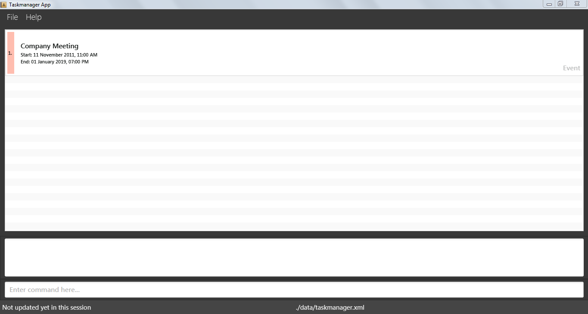

# Task Manager - User Guide

By : `Team POTATO`  &nbsp;&nbsp;&nbsp;&nbsp; Since: `Mar 2017`  &nbsp;&nbsp;&nbsp;&nbsp; Licence: `MIT`

---

1. [Quick Start](#quick-start)
2. [Features](#features)
3. [FAQ](#faq)
4. [Command Summary](#command-summary)

## 1. Quick Start

0. Ensure you have Java version `1.8.0_60` or later installed in your Computer. 

   > Having any Java 8 version is not enough.  
   > This app will not work with earlier versions of Java 8.

1. Download the latest `pota-todo.jar` from the [releases](../../../releases) tab.
2. Copy the file to the folder you want to use as the home folder for your task manager.
3. Double-click the file to start the app. The GUI should appear in a few seconds.
   > 

4. Type the command in the command box and press <kbd>Enter</kbd> to execute it.  
   e.g. typing **`help`** and pressing <kbd>Enter</kbd> will open the help window.
5. Some example commands you can try:
   * **`list`** : lists all tasks
   * **`add`**`meeting s/1/1/2017 e/2/1/2017`
     creates an event named `meeting` to the task manager.
   * **`delete`**` 3` : deletes the 3rd task shown in the current list
   * **`exit`** : exits the app
6. Refer to the [Features](#features) section below for details of each command. 

## 2. Features

**Command Format**
>
> * Words in `UPPER_CASE` are the parameters.
> * Items in `<SHARP_BRACKETS>` are compulsory.
> * Items in `[SQUARE_BRACKETS]` are optional.
> * Items with `...` after them  can have multiple instances.

### 2.1. Viewing help : `help`

**Format:** `help`

> Help is also shown if you enter an incorrect command e.g. `abcd`  

### 2.2. Creating a task: `add`

Add a task which can be an event, a deadline or a floating task.  
All newly added tasks will appear at the top of the task list.  

The date expression can be in standard language.  
**For example:**  
Formal dates: 02/28/1979  
Relaxed dates: oct 1st  
Relative dates: the day before next thursday  
Date alternatives: next wed  

**Accepted Start Markers :** `'from', 's/'`  
**Accepted End Markers :** `'at', 'to', 'by', 'e/'`  
**Aceepted Tag Markers :** `t/`  

`Time for a task will only be shown if it is specifically specified in the command itself. Otherwise, not time will be shown. For example, 12pm, 1400, 2.30pm.`  
`The start date specified must also be before the end date.`  

**Event format:** `add <TASK_NAME> [<START_DATE_MARKER> <DATE_START_TIME>] [<END_DATE_MARKER> <DATE_END_TIME>] [t/ TAG_NAME]...` 
**Example:**  
> add meeting with Boss from 25th April 1pm to 25th April 5pm t/important t/urgent    

This will add an event named 'meeting with Boss' with start date and time as 25th April 1pm and end date and time as 25th April 5pm with two tags 'important' and 'urgent'.  
              
              
**Deadline format:** `add <TASK_NAME> [END_DATE_MARKER] [DATE_DUE_TIME] [t/ TAG_NAME]...` 
**Example:**  
> add report submission by next wed   

This will add a deadline named 'report submission' with [DATE_DUE_TIME] as the following wednesday without time.  
               
               
**Floating task format:** `add <TASK_NAME> [t/ TAG_NAME]...`  
**Example:**  
> add confess to love  

This command will simply add a floating task named 'confess to love'.  

**WARNING**  
> `The command to add a task will not be accepted if it only specifies the start attributes in a task. To understand more, `  
     

### 2.3. Listing tasks : `list`

Shows a list of tasks which can include all tasks, only events, only deadlines or only floating tasks. The tasks can also be further filtered given a specified date. Several examples are given below for further clarification.  
**Format:** 'list <  done / undone / floating / event / deadline > [DATE]'   
**Example:**  
> list  

This command will simply list all the tasks.  

> list event  

This command will list all the event tasks (with no restriction on the dates of the tasks).  

> list March 27  

This command will display all the event and deadline type tasks which have either the start date or end date as 27th March.  

> list deadline Feb 28  

This command will list the deadline tasks which have the deadline as 28th February. Refer to note above regarding the usage of dates.  

> list undone  

This command will simply display all the tasks that have been marked as undone. 

**Note:  
> When listing tasks with an event type parameter and a date, only the event type tasks which have a start date or event date corresponding to the date in command will be displayed. When listing tasks with a deadline type parameter and a date, only the deadline type tasks which have a due date corresponding to the date in command will be displayed.**  

### 2.4. Updating a task : `edit`

Updates an existing task in the task manager.  
All newly updated tasks will appear at the top of the task list.  
In case the tags are editted, all the previous tags will be removed and will be replaced by the new specified tags.  
**Event format:** `edit <index> [TASK_NAME] [<START_MARKER> <DATE_START_TIME>] [<END_DATE_MARKER> <DATE_END_TIME>] [t/ TAG_NAME]`  
**Example:**  
> edit 3 edited_event from 7th May 12pm to 9th May 5pm  

This command will edit the task at index number 3 with a new name, new start date and time, new end date and time.  
Note: At least one of the [PARAMETERS] must be executed.  
    
            
**Deadline format:** `edit <index> [TASK_NAME] [<END_DATE_MARKER> <DATE_END_TIME>] [t/ TAG_NAME]`  
**Example:**  
> edit 4 edited_deadline e/03/05/2017 8pm  

This command will edit the task at index number 4 with new name, new end date and time.  
Note: At least one of the [PARAMETERS] must be executed.  
               
**Floating task format:** `edit <index> <NEW_TASK_NAME>`  
**Example:**  
> edit 5 edited_floating_task  

This command will simply edit the task at index number 5 with new name.  

**Changing a task type:**  
It is also possible too change a task type using the edit command. To remove a start type and end date, replace the date parameter with the command 'remove'. Editing a dealdine with an addtional start date will create an event with the new start date and the orginal due date as end date. Editing an event with start date and end date removed will result in the event to turn into a floating task.   

**Example:**  
> edit 5 project evaluation s/25th April  

This command will update the task 'project evaluation' which was a deadline task with end date only and make it an event task with start date as '25th April' and the end date as the old deadline date itself.  
Note: At least one of the [PARAMETERS] must be executed.  

> edit 4 exercise regularly remove  

This command will edit the task 'exercise regularly' by removing the dates added previously with this task. Thus, making it a floating task from an event type task.  
Note: At least one of the [PARAMETERS] must be executed.  

**WARNING:**  
`If a task only has the start attributes (after the edit command), it will not be accepted by pota-todo. To understand more, click **`  
`The start date specified must be before the end date.` 

### 2.5. Searching for all tasks containing a name : `find`

Searches for the tasks containing the input name. An example has been given below for further clarification.  
**Format:** `find <NAME>`  
**Example:**  
> find event  

This command will simply return the tasks with the name 'event' in them.  

**Note:   
> To find a task by date, use the `list` command**  
     

> * The search is not case sensitive. e.g `meeting` will match `Meeting`
> * The order of the keywords does not matter. e.g. `team meeting` will match `meeting team`
> * Only full words will be matched e.g. `meeting` will not match `meetings`
> * Tasks matching at least one keyword will be returned (i.e. `OR` search).
    e.g. `Meeting` will match `Company Meeting`

**Example:**  
> find meeting  

This command will return `company meeting` but not `date with girlfriend` or `meetings`  

### 2.6. Deleting a task : `delete`

Deletes a specified task. 
**Format:** `delete <INDEX>`  
**Example:**  
> delete 2    

This command will simply delete the task at index number 2 shown on the current list.  

### 2.7. Marking tasks as done: `mark`

Marks a particular task as either done or not done by changing the colour (RED for undone, GREEN for done) displayed next to the task in the task manager.  
**Format:** `mark <INDEX> <done/undone>`  
**Format:**  
> mark 4 done  

This command will dislay a green colour next to the task at index number 4 indicating that the particular task has been done.  

**Note:  
> Marking done to a task which is already done will not be accepted. Same applies to a task marked as undone.
> The string "done/undone" is not case-sensitive.**  

**Example:**  
> mark 1 dOnE  

### 2.8. Undo a command : `undo`

Undo the previous command executed. There is no limit to the number of undo actions that the task manager can execute.  
**Note:  
> The undo command can be used only by the {add,mark,edit,clear} commands. **  

**Format:** `undo`  
**Example:**  
> add meeting with professor  
> undo  

The first command will add the floating task 'meeting with professor'. The second command will remove the floating task 'meeting with professor' from the task manager therefore 'undoing' the previous command.  

### 2.9. Redo a command : `redo`

Execute the command undone by the previous undo command. Redo will basically undo the previous 'undo' command. Redo can be executed as many times as the 'undo' command execute right before the start of 'redo' command. However, there is no limit to the number of redo actions that the task manager can execute since there is no limit to the number of undo actions. 

**Note:  
> The redo command can be used only by the {add,mark,edit,clear} commands. **  

**Format:** `redo`  
**Example:**  
> add meeting with professor  
> undo  
> redo  

The first command will add the floating task 'meeting with professor'. The second command will remove the floating task 'meeting with professor' from the task manager therefore 'undoing' the previous command. The third command will add the floating task 'meeting with professor' again therefore 'undoing' the previous undo command.  

### 2.10. Setting notification period : `set`

Changes the setting of the time period of notification. An expiring task within stipulated time period will have a clock icon shown on the top right.

**Format:** `set <TIME_PERIOD> `  
**Example:**  
> set 1 week  

This command will display a clock icon on the top right of the tasks which are expiring in one week. The new settings will be applied on the next launch of pota-todo.  
**Note:  
> There is no limit to the time period. It can be 3 days or 1 week or 4 months or 123 years.**  

### 2.11. Changing the Filepath : `filepath`

Changes the save file directory. 

**Format:** `filepath [FILE_DIRECTORY]`  
**Example:**  
> filepath potato.xml  

This command will change the save file directory to potato.

**Note:  
> The file directory specified must end with ".xml".**  

### 2.12. Exiting the program : `exit`

Exits the program. 
**Format:** `exit`  

### 2.13. Saving the data
Task manager data are saved in the hard disk automatically after any command that changes the data. 
There is no need to save manually.  

## 3. FAQ

**Q:** How do I transfer my data to another Computer? 
**A:** Install the app in the other computer and overwrite the empty data file it creates with the file that contains the data of your previous task manager folder.  

**Q:** Why is it that I cannot create/edit a task with only a start date?  
**A:** This is due to how pota-todo deals with categorisation of task.  
> * Events: Start Date and End Date
> * Deadlines: End Date Only
> * Floating: No dates  
As there are no valid task types with only a start date attribute, it is not accepted.  

## 4. Command Summary

* **Create an event** : `add <TASK_NAME> [<s/>DATE_START_TIME] [<e/>DATE_END_TIME]`  
  e.g. `add birthday party s/1/1/2088 1200 e/1/1/2088 1230`
 
* **Create a deadline** : `add <TASK_NAME> [<e/>DATE_DUE_TIME]`  
  e.g. `add homework e/1/1/2088 1200`
  
* **Create a floating task** : `add <TASK_NAME>`  
  e.g. `add stay_healthy`
  
* **Edit Event format** : `edit  <index> [NEW_TASK_NAME] [<s/>NEW_DATE_NEW_START_TIME] [<e/>NEW_DATE_NEW_END_TIME]`  
            e.g. `edit 3 edited_event s/01/01/2088 1200 e/01/01/2088 1230`
            
* **Edit Deadline format** : `edit <index> [NEW_TASK_NAME] [<e/>NEW_DATE_NEW_DUE_TIME]`  
               e.g. `edit 4 edited_deadline e/01/01/2088 1200`
               
* **Edit Floating task format** : `edit <index> [NEW_TASK_NAME]`  
                   e.g. `edit 5 edited_floating_task`
                   
* **Delete** : `delete <INDEX>`  
   e.g. `delete 1`

* **Search** : `find <NAME> `  
  e.g. `find meeting` `find NUS` 

* **List** : `list`  
  e.g. `list`

* **Help** : `help`  
  e.g. `help`

* **Mark Tasks as Done/Undone** : `mark <INDEX> <done/undone>`  
   e.g. `mark 2 done` `mark 5 undone`

* **Undo a command** : `undo`  
   e.g. `undo`

* **Redo a command** : `redo`  
   e.g. `redo`

* **Setting notification period** : `set`  
   e.g. `set 4 days`
   
* **Changing the filepath** : `filepath [FILE_DIRECTORY]`  
   e.g. `filepath tomato.xml`
   
* **Exit** : `exit`  
   e.g. `exit`
